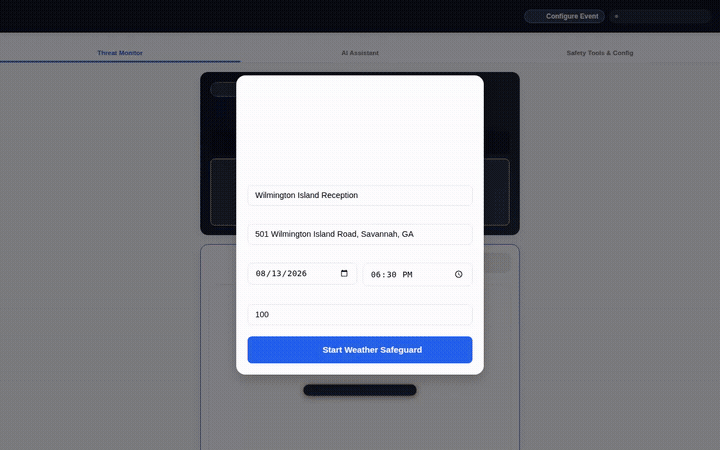

# 🛡️ SafeStageWX: Event Weather & Climate Safeguard

> **An enterprise-grade, mobile-responsive event safety platform and AI assistant that protects outdoor events (concerts, festivals, athletic events) by combining live NWS warning polygons, SPC mesoscale discussions, interactive weather radar, automated evacuation decision math, and conversational AI safety grounding.**

---

*Live SafeStageWX Demo: Real-time Threat Monitoring, NWS Point Forecasts, Egress Decision Parameter Imports, and Omni Video Generation.*

---

## 📋 Overview & Problem Statement

Outdoor venue operators, event directors, and emergency managers face severe weather hazards—including convective lightning, damaging wind gusts, extreme heat, and severe thunderstorms. **SafeStageWX** eliminates guesswork by fusing real-time National Weather Service (NWS) & Storm Prediction Center (SPC) data with deterministic evacuation math and a conversational Gemini 2.5 AI Safety Assistant.

### Key Capabilities:
- 🌩️ **Live Threat Monitor & Warning Polygons**: Real-time NWS alerts, interactive RainViewer 480px weather radar overlay, and dynamic Call-to-Action safety banners tailored to active warning types (e.g. hydration for heat, sturdy shelter for lightning/wind).
- ⏱️ **Real-time SVG Decision Countdown Ring**: Animated SVG circular progress ring counting down second-by-second toward the Decision Deadline (`Act Time`).
- 📄 **1-Tap EAP PDF Exporter**: Instant generation of branded Emergency Action Plan (EAP) PDF reports via `html2pdf.js` for local first responders and incident command staff.
- 🤖 **Gemini 2.5 Safety Assistant**: Deployed on Vertex AI Agent Engine with A2UI rich card rendering for date-specific NWS point forecasts, SPC mesoscale discussions, and custom Emergency Action Plans (EAP).
- ⏱️ **Evacuation & Sheltering Decision Tool**: Official 3-step decision math ($TET = \text{Alert Time} + \text{Walk Time} + 25\% \text{Safety Cushion}$) vs. storm vector speeds to calculate trigger distances and act deadlines.
- 📥 **1-Tap Egress Parameter Import**: Direct import of calculated evacuation parameters into the AI Assistant context thread for downstream decision support.
- 📢 **PA Script Broadcast Generator**: Pre-approved stadium announcements for instant lightning, high-wind stage shutdown, or general weather advisories.
- 🎬 **Omni Video Advisory Generation**: Generates short safety advisory videos using `gemini-omni-flash-preview` and uploads them to public Cloud Storage.

---

## ☁️ Google Cloud Tools & Architecture

SafeStageWX leverages the full Google Cloud & Vertex AI Agent Development Kit (ADK) stack:

| Google Cloud Tool | Integration & Usage |
|---|---|
| 🧠 **Vertex AI Memory Bank** | Remembers cross-session venue preferences, default addresses, and structural wind threshold rules across conversations. |
| 🗄️ **Google Cloud Firestore** | Persists event profiles (`manage_event_details_firestore`), attendee counts, venue coordinates, and calculated safety plans. |
| 🖼️ **Google Cloud Storage (GCS)** | Direct in-memory byte upload for generated video advisories (`qwiklabs-gcp-04-72024f788a4d-static-assets-bucket`) returning public HTTPS URLs. |
| 📖 **Vertex AI RAG Engine** | Grounds safety advice on venue structural wind load standards, NWS evacuation guidelines, and stadium crowd management protocols. |
| 🎨 **Media Generation (Gemini Omni & Imagen 3)** | Utilizes `gemini-omni-flash-preview` in the global region for video advisory synthesis (`generate_event_safety_video`) and Imagen 3 for visual safety cards. |
| 🪟 **A2UI (Agent-to-User Interface)** | Renders rich, interactive UI display cards (weather summaries, structural risk profiles, EAP summaries) directly inside the chat stream. |
| 🌐 **Google Cloud Run** | Hosts the containerized FastAPI proxy and mobile-first glassmorphism web interface (`event-weather-safeguard-frontend`). |

---

## 🏛️ Application Architecture & Navigation

### 1️⃣ **Tab 1: Threat Monitor**
- **Dynamic Call to Action Banner**: Automatically recommends safety actions based on active NWS warning polygons (e.g. hydration/cooling stations for heat; immediate sturdy indoor evacuation for severe convective storms).
- **Interactive Radar Map**: 480px RainViewer radar centered on venue coordinates with a gold location star badge overlay.
- **Action Cards**: Live polygon status indicators and calculated Lead Time to Shelter.

### 2️⃣ **Tab 2: AI Assistant**
- **Conversational Safety Loop**: Powered by Gemini 2.5 on Vertex AI Reasoning Engine (`reasoningEngines/1691330358496198656`).
- **A2UI Rich Renderer**: Native rendering of flat A2UI cards for weather summaries, risk profiles, and safety plans.
- **Custom Tools**:
  - `get_nws_point_forecast`: Date-specific 7-day NWS point forecasts.
  - `get_nws_active_alerts`: Live severe weather watches, warnings, and advisories.
  - `spc_mesoscale_discussions`: NOAA SPC technical severe weather boundary analysis.
  - `calculate_coordinates_and_address`: Geocoding via Nominatim.
  - `manage_event_details_firestore`: Event profile persistence in Cloud Firestore.
  - `generate_event_safety_video`: Omni video generation with GCS upload and artifact saving.

### 3️⃣ **Tab 3: Safety Tools & Config**
- **Venue Reference Map**: Interactive map with venue location star pin and primary sturdy shelter rules.
- **Warning Radius Selector**: Buffer monitoring zone toggle (10 / 20 / 30 miles).
- **Evacuation Decision Math**:
  $$\text{Total Evacuation Time (TET)} = (\text{Alert Time} + \text{Walk Time}) \times 1.25$$
  Calculates Time Until Arrival (TUA), Trigger Distance, and Decision Deadline (Act Time).
- **Import to AI Assistant**: Button to inject parameters straight into the chat assistant.
- **PA Broadcast Generator**: Ready-to-read stadium scripts with 1-tap copy functionality.

---

## 🧪 Evaluation Benchmark

**Eval Query:**
> *"I am hosting an outdoor event on August 13 at 501 Wilmington Island Road, Savannah, GA with 100 guests. Check active warning polygons, calculate evacuation decision trigger distances for 40 MPH convective storms, and provide recommended safety actions."*

---

## 🚀 Live Links & Resources

- 🌐 **Live Web Application**: [https://event-weather-safeguard-frontend-746320986672.us-east1.run.app](https://event-weather-safeguard-frontend-746320986672.us-east1.run.app)
- 🐙 **GitHub Repository**: [https://github.com/felix1028/buildwithgemini-safestagewx](https://github.com/felix1028/buildwithgemini-safestagewx)
- 🎥 **Demo Recording Video**: [demo_video.webm](demo_video.webm) | [demo.gif](demo.gif)
